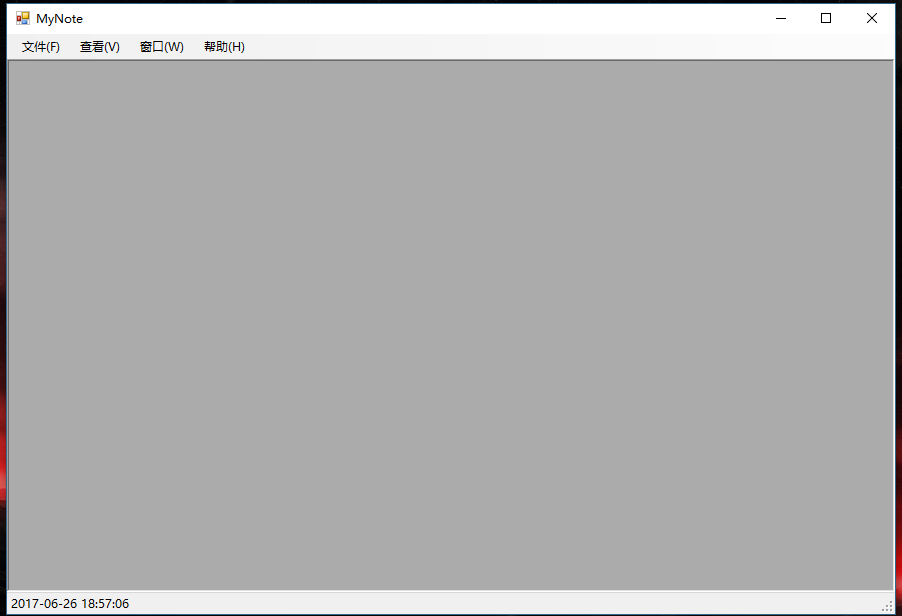
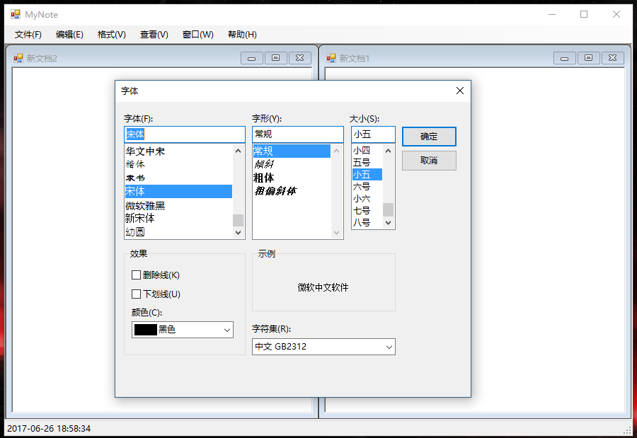
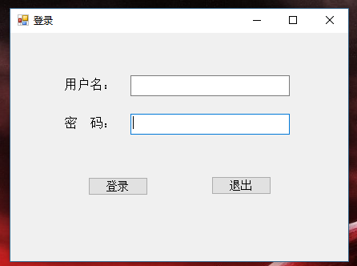
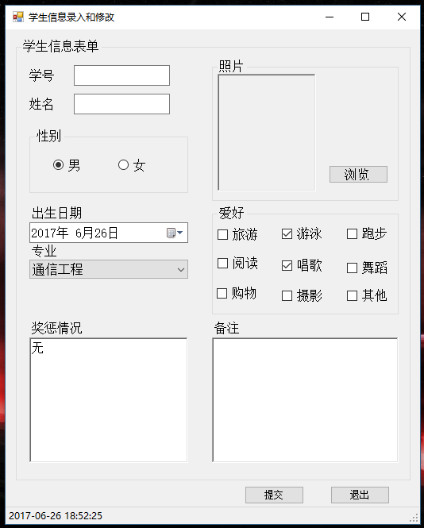
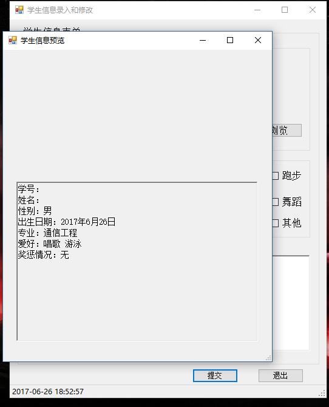
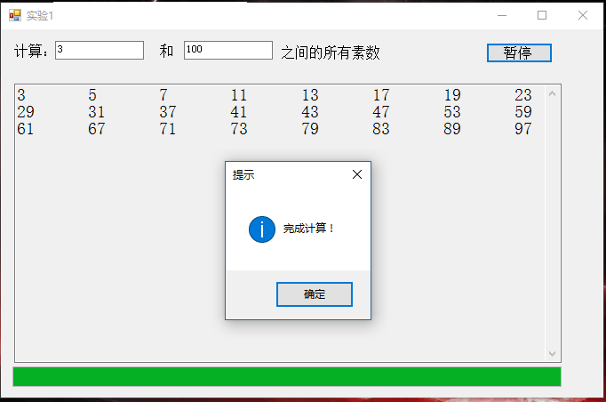

# MyNote
VB.NET建立的仿windows记事本小程序  
## 主窗体
MDI父窗体，设计界面如下：  
  
### 文件菜单  
新建：产生一空白编辑窗体（见（2）编辑窗体），标题为“新文档1”、“新文档2”...，可同时打开多个子窗体  
打开：弹出打开对话框，用户选择要打开的文本文件后，打开一编辑窗体，并将选中文件的内容在文本框中显示，窗体标题为文件名  
保存：若编辑窗体中的文件已有文件名，按原文件名保存。若编辑窗体中的文件是新建的，则功能同“另存为”  
另存为：弹出保存对话框，用选择目录、输入文件名后，点击保存，即以该文件名保存，同时将窗体标题改为文件名，若用户未输入扩展名，即以TXT作为扩展名保存  
退出：即退出程序。注意，点击退出后，若存在已经修改但未保存的文档，则弹出信息提示框，询问用户是否保存，若用户选择是，则保存文件，功能同保存和另存为菜单功能  
### 查看菜单  
状态栏：为选项菜单，默认已经选中，此时显示状态栏；点击即取消选中，此时隐藏状态栏  
### 窗口菜单  
水平平铺：水平摆放各子窗体  
垂直平铺：垂直摆放各子窗体  
层叠：以层叠方式摆放各子窗体  
当打开子窗体后，下面显示子窗体列表  
### 帮助菜单  
关于MyNote：打开关于窗口，显示程序及开发人员基本信息
## 编辑窗体  
MDI子窗体，包含1个菜单条、1个始终占满整个窗体的RichTextBox控件，菜单条设置为隐藏，界面如下：  
  
### 编辑菜单  
其中剪切、复制、删除默认为不可用，只在用户选中文字后才变为可用，通过对文本框的SelectionChanged编程实现该功能  
粘贴默认为不可用，只在剪切版中有文字时才变为可用。在窗体中添加Timer控件，定时读取剪贴板上的数据，若剪贴板上有文字，“粘贴”菜单可用，否则不可用  
全选：点击后可选中文本框中的所有文字  
替换：点击后，打开“替换”对话框  
### 格式菜单  
字体：打开字体对话框，对当前活动子窗体中的文字进行设置。在打开字体对话框前作设置，使打开对话框时，预选中的字体、字号、颜色等与文本框中的当前设置一致  
注意：    
1. 当打开子窗体时，“编辑”和“格式”两项菜单须插入到主菜单的“文件”和“查看”之间。
此功能通过设置“编辑”菜单和“格式”菜单的MergeAction和MergeIndex属性实现  
2. 在关闭窗体时，检查是否有已经修改但尚未保存的文档，如果有，提示用户保存。因为可能会创建该窗体的多个实例，为了保存每个子窗体中打开的文件的文件名以及是否有未保存的修改。在窗体类中设两个Public类型的变量，一个变量用来保存在窗体中打开的文件的文件名，在保存、另存为、打开文件时设置该变量，同时在窗口标题栏显示，另一个变量用来保存是否有修改，若有文字的修改，将该变量设为1，通过对文本框的TextChanged事件编程实现；保存文件时，将该变量设为0。在窗体关闭时，读取该变量的值，以确定是否需要提示用户保存  
3. 替换框的边框为对话框边框，以模态窗口打开，当用户输入“查找的内容”和“替换为”后，点击“全部替换”按钮，即将当前活动子窗体中的文字按输入的内容替换。使用InStr函数查找匹配位置，根据位置和“查找的内容”长度，选中相应的文字，然后将选中的文字赋值为“替换为”的文字，并且采用循环语句继续查找下一个可能匹配的文字进行替换  
# HomeWork  
VB.NET建立的管理员登录并录入学生信息小程序    
## 标准模块  
申明2个公共变量，path和info分别用来存放学生照片的存储路径和通过“学生信息录入和修改”窗体录入的信息，以便在“预览窗体”中显示相应的内容  
## 欢迎界面
一个无边框窗体，如下图所示：  
  
其中：“登录”采用LinkLabel类型的控件，点击后可跳转到登录对话框  
## 登录对话框
登录对话框如下图所示：  
  
其中：用户名和密码均采用TextBox控件，密码符号采用“*”；输入用户名和密码，点击“登录”按钮，即检查用户名和密码正确与否；若用户名为“ABC”，密码为“123”，则进入“学生信息录入和修改”窗体。
否则，若未输入用户名或密码，点击“登录”按钮后显示“信息不完整，请重新填写”；若用户名或密码错误，则显示“用户名或密码错误”；若3次输错用户名或密码，则显示提示框后退出程序；点击“退出”按钮或标题栏里的关闭按钮，均退出程序  
## 学生信息录入和修改窗体
登录后即打开“学生信息录入和修改”窗体，如下图所示：  
  
其中，窗体大小不允许改变；学号、姓名均使用单行TextBox控件；性别使用GroupBox加RadioButton控件；出生日期使用DateTimePicker控件；专业使用ComboBox控件，只能从列表中选择选项，不能自行输入，通过窗体加载事件过程填充；照片使用PictureBox控件显示，点击其右边的“浏览”按钮，打开“选择学生照片”对话框。其中，标题为“选择学生照片”，文件过滤器包含4种，分别为全部图片、BMP文件、JPEG文件、GIF文件，且默认选择JPEG文件。选择图片文件后，点击“打开”按钮，将选择的图片在图片框中显示；
爱好包括9种不同的兴趣爱好，由一个GroupBox控件包含多个CheckBox控件构成；奖惩情况和备注都使用RichTextBox控件（功能和属性与TextBox相同）；窗体下方包含一个状态条，显示当前的日期和时间。日期和时间应实时变化（使用Timer控件）；点击“提交”按钮，以模态方式打开“预览窗体”，同时将输入的数据在其中显示；点击“退出”或标题栏中的关闭按钮，均关闭程序  
## 预览窗体
预览窗体如下图所示：  
  
其中，下面的RichTextBox控件为只读  
# CaculatePrime  
VB.NET建立的计算两个正整数之间素数的小程序  
## 功能
1. 窗口大小不允许改变，程序运行时，窗口位于屏幕的中间  
2. 计算任意两个正整数之间的所有素数  
3. 在多行文本框中输出结果，同时通过进度条显示计算进度，界面如下：  
  
## 实现  
1. 窗口上部两个文本框用来输入素数的起始范围，大小顺序不限，限定只能输入数字和退格键，若输入错误，弹出提示框，对文本框的KeyPress事件编程，通过事件过程参数e的KeyChar获取用户按键，通过对事件过程参数e的Handled属性赋值（True或False），使用户按键无效或生效。  
2. 窗口中间的文本框用来显示找到的素数，其为多行文本框，有垂直滚动条，且为只读  
3. 窗口包含一个定时器控件，其间隔时间为50毫秒，每隔50毫秒计算一个数是不是素数，并通过进度条显示当前进度。若是素数则在文本框中显示该数，否则等待50毫秒计算下一个数，直到指定范围的数全部计算完，最后显示提示信息  
4. 窗口下部有一个进度条，实时显示计算进度  
5. 窗口右上有一个按钮，其初始标题文字为“开始”，且其标题文字可在“开始”、“暂停”、“继续”之间切换。当点击“开始”按钮时，首先清空下面多行文本框，并控制定时器控件开始计算，同时，按钮标题文字改为“暂停”；当点击“暂停”按钮时，控制定时器控件停止计算，同时按钮标题文字改为“继续”，如图4所示；当点击“继续”按钮时，控制定时器控件继续计算，同时按钮标题文字改为“暂停”，当计算完毕，按钮标题文字改为“开始”  